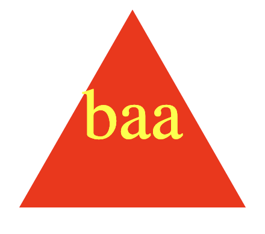
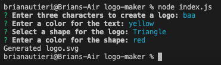

# SVG Logo Maker

## Description

The purpose of this project was to give users a way to create a logo using SVGs. The user can enter three characters of their choice and choose from a variety of colors and shapes to customize their logo. 

## Usage

Through the integrated terminal, users can run the application by entering "node index.js" and pressing enter. The user will then be prompted to enter:

- Three characters of their choice
- A color for the text
- A shape for the logo
- A color for the shape

Once the user has entered all of the required information, the application will generate an SVG logo with the user's choices. The logo will be saved in the "logos" folder. Right click on logo.svg and select "Open with Live Server" to view the logo in the browser.

### Video Demonstration Link

https://drive.google.com/file/d/1t2yM7CK8ESOvu4Z08QcheRoLwEWj9jLX/view

### Application Screenshots

## Credits

This challenge was completed in collaboration with the instructional staff (Diarmuid Murphy), TA/Tutor (Meg Meyers) and classmates in the February 2023 UCLA Extension Coding Boot Camp.

## License

MIT License

Copyright (c) 2023 Brian Autieri

Permission is hereby granted, free of charge, to any person obtaining a copy of this software and associated documentation files (the "Software"), to deal in the Software without restriction, including without limitation the rights to use, copy, modify, merge, publish, distribute, sublicense, and/or sell copies of the Software, and to permit persons to whom the Software is furnished to do so, subject to the following conditions:

The above copyright notice and this permission notice shall be included in all copies or substantial portions of the Software.

THE SOFTWARE IS PROVIDED "AS IS", WITHOUT WARRANTY OF ANY KIND, EXPRESS OR IMPLIED, INCLUDING BUT NOT LIMITED TO THE WARRANTIES OF MERCHANTABILITY, FITNESS FOR A PARTICULAR PURPOSE AND NONINFRINGEMENT. IN NO EVENT SHALL THE AUTHORS OR COPYRIGHT HOLDERS BE LIABLE FOR ANY CLAIM, DAMAGES OR OTHER LIABILITY, WHETHER IN AN ACTION OF CONTRACT, TORT OR OTHERWISE, ARISING FROM, OUT OF OR IN CONNECTION WITH THE SOFTWARE OR THE USE OR OTHER DEALINGS IN THE SOFTWARE.
